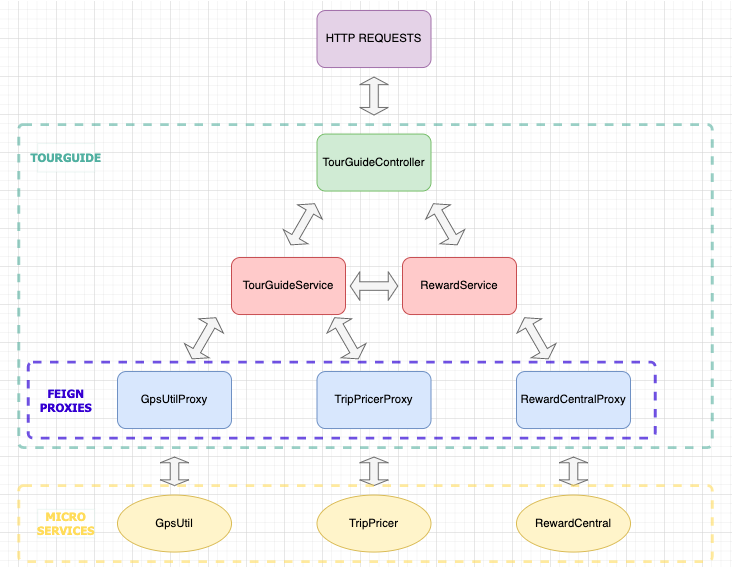

# TourGuide

Poseidon is an application that offers attractions based on the user's location and rewarding him when he visits them. 

## Prerequisites

What things you need to run this application

- Your favorite IDE in Java
- Docker Desktop

If you don't have Docker, follow the link :

https://www.docker.com/products/docker-desktop/

## Instructions

1.Make sure docker is installed and running

2.Clone this repository

3.Run `gradle build` to build the application war

4.Run `docker-compose up`

5.Stop the application by using `docker-compose down`

### Presentation of the architecture

### Testing

The app has unit tests and integration tests written.

To run the tests from gradle, execute the below command :

`gradle test`